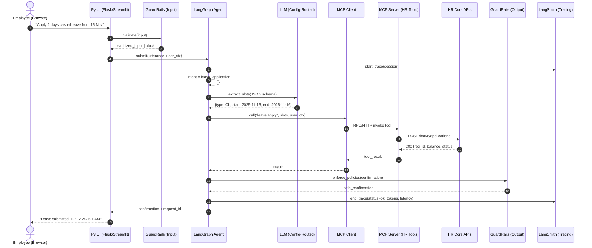

# Software Requirements Specification (SRS) — HR Policy Chat Assistant

> **Domain:** HR Policy Chat Assistant  
> **Use Case Summary:** Employees can search HR policies and apply for leaves via a conversational interface.  
> **Architecture Goals:** Cost-effective GenAI system with **LLM provider switching** via configuration/minimal changes, **RAG**, **MCP** for enterprise actions, **GuardRails** for safety, **LangSmith** for tracing, and a **Python-based UI**.

---

## 1. Introduction

### 1.1 Purpose
Define functional and non-functional requirements, flows, and architecture for a GenAI-powered HR Policy Chat Assistant that supports policy search and leave application with configurable LLM backends and cost controls.

### 1.2 Scope
- Chat search over HR policies (structured/unstructured).
- Apply leave via enterprise HR systems.
- Python-based web UI.
- RAG with Vector DB.
- MCP APIs for HR actions (e.g., leave).
- Guardrails for safety/compliance.
- LangSmith for monitoring/tracing.
- Pluggable LLM with minimal configuration.

### 1.3 Stakeholders
- Product, HR Operations, Engineering, Security/Compliance, SRE/Platform.

### 1.4 Definitions & Acronyms
- **RAG:** Retrieval-Augmented Generation.  
- **MCP:** Model Context Protocol (hosted HR domain tools).  
- **LLM:** Large Language Model (pluggable).  
- **LangGraph/Chain:** Orchestration and tool routing.  
- **GuardRails:** Policy/safety validation/filtering.  
- **LangSmith:** Tracing/observability.

---

## 2. System Overview

### 2.1 High-Level Description
A web-based chat app where authenticated employees can search HR policies through RAG and execute leave workflows via MCP. The agent orchestrates intent detection, retrieval, tool calls, response generation, guardrail checks, and telemetry.

### 2.2 Implementation Flow (Conceptual)
1. **UI (Python) → Agent**: Receive utterance + user context.  
2. **GuardRails (input)**: Validate/redact/jailbreak protection.  
3. **Agent (LangGraph)**: Route to **RAG** or **MCP** path.  
4. **RAG**: Retrieve top-k chunks from Vector DB → LLM synthesis.  
5. **MCP**: Call HR APIs (leave eligibility, apply).  
6. **GuardRails (output)**: Enforce policy/safety.  
7. **LangSmith**: Trace, metrics, error analysis.  
8. **UI**: Render with citations (policy) or confirmation (leave).

---

## 3. Functional Requirements

| ID | Requirement |
|---|---|
| FR-1 | Chat-based interface for HR policy Q&A. |
| FR-2 | RAG pipeline to retrieve HR policy chunks with citations. |
| FR-3 | Intent detection & state management with LangGraph (policy search vs leave application). |
| FR-4 | Leave application via MCP tools: balance check, date validation, create request, status return. |
| FR-5 | GuardRails on both input and output (toxicity, PII minimization, policy constraints). |
| FR-6 | LangSmith tracing for all agent steps, tools, errors, latencies, costs. |
| FR-7 | Authentication via SSO/OAuth2; use JWT in session. |
| FR-8 | Vector DB for embeddings (create/update/delete documents; reindex jobs). |
| FR-9 | Multilingual queries (EN + configured locales) with locale-aware retrieval. |
| FR-10 | UI shows sources, confidence, and request IDs. |
| **FR-11** | **LLM provider switching via configuration** (env/config file/feature flag) with minimal or no code changes. |
| **FR-12** | **Cost controls**: per-request max tokens, model routing by budget, automatic fallbacks. |
| FR-13 | Admin operations: document ingestion, re-embed, purge; MCP endpoint config. |
| FR-14 | Telemetry dashboard (LangSmith + infra metrics) visible to admins. |
| FR-15 | Redaction of sensitive content before persistence/logging. |

---

## 4. Non-Functional Requirements

### 4.1 Performance & Scale
- P1 queries (simple policy search): **p95 < 3s** with cached embeddings.
- P2 queries (leave application + MCP): **p95 < 5s**.
- Concurrency target: **2k active sessions**, horizontally scalable on K8s.

### 4.2 Reliability & Availability
- **99.5%** monthly availability.
- Graceful degradation: if LLM-A fails, route to LLM-B; if RAG fails, present fallback FAQ link.

### 4.3 Security & Privacy
- TLS 1.2+; JWT session tokens; role-based authorization for HR actions.
- Data minimization: store hashed user IDs; scrub PII from logs.
- Vector store restricted to HR policy corpus; no cross-tenant leakage.

### 4.4 Compliance
- Retention per enterprise policy; configurable data residency.
- Audit trail for all MCP actions with user, time, parameters (redacted).

### 4.5 Observability
- LangSmith traces for: prompts, tools, token usage, latencies, errors.
- Prometheus/Grafana for infra; alerts on error-rate/cost spikes.

### 4.6 Maintainability & Portability
- Modular services: UI, Agent, RAG, MCP client, GuardRails adapter.
- IaC for repeatable deploys; Helm charts; twelve-factor app config.

### 4.7 **Cost Effectiveness**
- **Token budgets** by route (search vs leave).  
- **Model router**: map intents to **tiered models** (cheap → default, premium → complex).  
- **Caching**: prompt templates, retrieved chunks, and embeddings.  
- **Batch & streaming** where applicable; **max_new_tokens** caps.  
- **Shadow eval** off by default in production to reduce overhead.

---

## 5. Use Cases & Flows

### 5.1 Use Case: Search HR Policy

```mermaid
sequenceDiagram
  autonumber
  actor Emp as Employee (Browser)
  participant UI as Py UI (Flask/Streamlit)
  participant GuardIn as GuardRails (Input)
  participant Agent as LangGraph Agent
  participant Ret as RAG Retriever
  database VDB as Vector DB (FAISS/Chroma/Pinecone)
  participant LLM as LLM (Config-Routed)
  participant GuardOut as GuardRails (Output)
  participant LS as LangSmith (Tracing)

  Emp->>UI: "What is the maternity leave policy?"
  UI->>GuardIn: validate(utterance, pii, jailbreak)
  GuardIn-->>UI: sanitized_utterance | block
  UI->>Agent: submit(query, user_ctx)
  Agent->>LS: start_trace(session)
  Agent->>Agent: intent = policy_search
  Agent->>Ret: retrieve(query, top_k=n)
  Ret->>VDB: similarity_search(emb(query))
  VDB-->>Ret: chunks + scores
  Ret-->>Agent: ranked_chunks (citations)
  Agent->>LLM: prompt(context=chunks, template=policy_answer)
  LLM-->>Agent: draft answer + citations
  Agent->>GuardOut: enforce_policies(answer)
  GuardOut-->>Agent: safe_answer
  Agent->>LS: end_trace(status=ok, tokens, latency)
  Agent-->>UI: answer + citations
  UI-->>Emp: Render with sources
```

### 5.2 Use Case: Apply for Leave



---

## 6. Technology Stack

| Layer | Technology | Purpose |
|---|---|---|
| UI | Python (Flask/Streamlit) | Chat interface |
| Agent | LangChain + LangGraph | Orchestration |
| LLM | Configurable (OpenAI, Anthropic, Azure, Ollama) | Response generation |
| RAG | Chroma/FAISS/Pinecone | Retrieval augmentation |
| GuardRails | GuardRails.ai | Safety & compliance |
| LangSmith | LangSmith SDK | Tracing & metrics |
| MCP | Model Context Protocol | HR actions (leave) |
| Auth | OAuth2/SSO/JWT | Authentication |
| Infra | Docker + Kubernetes | Deployment |
| Monitoring | Prometheus + Grafana | Observability |

---

## 7. Future Enhancements

- Voice I/O.  
- Proactive notifications.  
- Multimodal RAG (image/text).  
- HR analytics dashboard.  
- Fine-tuned domain LLM.

---

## 8. Configuration Example

```yaml
llm:
  provider: openai
  model_default: gpt-4o-mini
  model_premium: gpt-4o
  routing_rules:
    policy_search: default
    leave_application: default
  fallbacks:
    - provider: anthropic
      model_default: claude-3-haiku
  cost_limits:
    per_request_token_cap: 8000
    downgrade_if_high_cost: true
```

---
